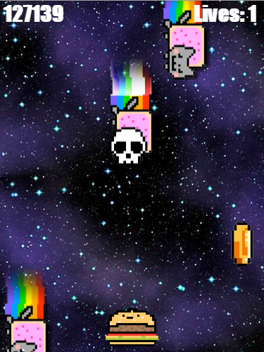

# Object Oriented Programming Game Project

<h2 align="center">I CAN HAZ CHEEZBURGER?!??</h2>

This is a game I'm working on in Oct 2017 for a Javascript module of my Web Developer bootcamp. I'm learning how to push to a remote repository as well, by doing this and writing this document. Original game by Ziad Saab at DecodeMTL.

Friday October 13 2017 changes:
* there are coins which add 10000 points to your score when you hit them.
* the cats' exhaust and tail do not kill you //DONE
* whenever an enemy's speed is greater than 0.5, they receive a special Skullcat sprite (no other special properties)
* animate the enemies and the falling coins with a spritesheet
* added a soundtrack and sound effects
* added a special gameover screen where everything fades out 
* added a restart button on the gameover screen
* you have 3 lives 
* added two popups: an "ouch" impact popup when an enemy hits you, and a "+10000" popup when you hit a coin.
* added a special dead player sprite with crossed out eyes
 

to do:
* add another level with harder difficulty?
* add more visual effects
* make a separate subclass of Enemy called SkullCat, with special properties. Maybe they'll take away all your lives at once.
* out of curiosity: Figure out why changing the || operator to an && operator in the enemy placing function will make the game jump.
* add lasers like Mike's
* add different kinds of weapons

------------

Documentation

## How the Game Works 

1. images are loaded using document.createElement and added to an images array
2. sounds are loaded using document.createElement and added to a sounds array

3. the Entity class is defined
4. Player, Enemy, Coin and popUp classes are defined as subclasses of Entity
5. scoreFlash and impactPopUp classes are defined as subclasses of popUp
they all have *update* and *render* functions, which are called every gameLoop
to change their properties and draw them in their new positions. 

6. Coin and Enemy classes have special lines in their *update* and *render* functions that animate them. Check out **"How Animation Works"** for specificcs
7. Player has a *move* function which is passed messages from a keydown listener.
8. Engine class is defined, and the game system and rules are made here:

*setupThings* function 
1. creates the catsAndCoins and popups arrays
2. checks if there's room to create objects in the catsAndCoins array (up to the maxThings number),
3. while there's room, runs the 

*addSomething* function which 
1. picks a random lane 1-5. Checks if that number index in the catsAndCoins array is empty.
2. adds a new object to the catsAndCoins array in that index, by calling a coin or enemy constructor function with the argument (lane * width) to position it in the correct lane horizontally
3. a random number between 0 and 1 is generated. if it's over 0.2, the new object
is an enemy. otherwise it's a coin.

*start* function sets up the conditions for a new game- 
1. creates a new player object,
2. sets score to 0, lives to 3, 
3. restarts the game music, and 
4. starts the gameLoop function.

*gameLoop* function 
1. stores the time passed since the last frame in the *timeDiff* variable. 
2. calls *update* function on all cats, Coins and popups passing timeDiff
3. draws the background, renders the cats, coins and popups and players in that order.
4. checks if any cats or coins are below the screen and deletes them.
5. checks if any popups have existed past their max duration and deletes them
6. runs *setupThings* to add more cats and coins if necessary
7. checks if the player is dead by evaluating isPlayerDead (or if I pressed the gameOver button, for debug purposes only). If dead, run the gameOver function. If not dead, draw the score and the lives remaining.

*isPlayerDead* function
1. returns value of this.catsAndCoins.some(), which runs a function on every element in the array and returns true if the function returns true for any of them.
2. the function is anonymous and takes two arguments: the value of the element on which it's being run (a cat or a coin object), and the index of that element. It checks 
    1. if the object's x is the same as the player.x, 
    2. checks if the y value of the bottom of the object is greater than (past) the y value of the top of the player, 
    3. and checks if the bottom of the object(or rather a point 25 pixels up from the bottom) hasn't yet passed the bottom of the player. 
If all these are true, that means the player has hit it. If it's an enemy, 
        1. a life is taken away, 
        2. a sound effect plays, 
        3. a popup is made, 
        4. and the enemy object is deleted. 
        5. If there's no lives to take away, the function returns true (and so isPlayerDead() will return true.) 
If it's a coin, 
1. 10000 points are added to the score, 
2. a sound effect plays, 
3. a popup is made, 
4. and the coin object is deleted.

---
